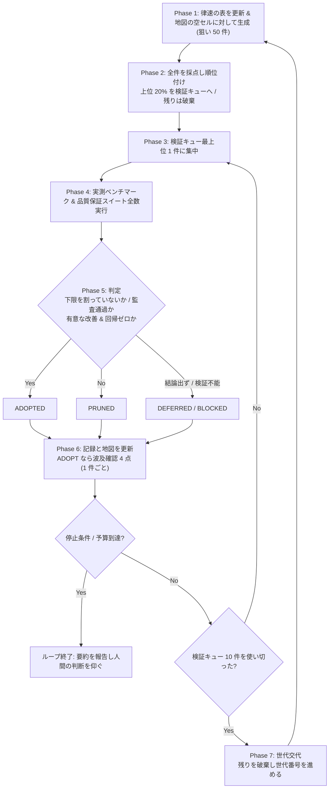

# Fail-Fast Moonshot Research Loop

未解決・高難度の計算問題に対して、10倍のブレークスルーを狙う仮説を大量に出し、1件ずつ実測で検証して素早く採否を決め、世代ごとに提案を作り直しながら回し続ける研究開発ループである。

このファイルが定めるのは **ループの規律そのもの** である。対象プロジェクト固有の値（パス、検証コマンド、Ground Truth、目標）は次節の「プロジェクト設定」に集約してあり、**そこだけ差し替えれば別の問題にも使える**。本文中でパスやコマンドを参照するときは、常にこの表の値を指す。

---

## プロジェクト設定 (Project Configuration)

| 項目 | 現在の値（sister-problem / OEIS A007764） |
| :--- | :--- |
| 最終目標 | $a(28)$ の完全計算（$n \times n$ 格子の自己回避経路数） |
| 品質保証コマンド | `python math/src/verify_all.py` |
| Tier 定義の正本 | `VERIFICATION.md` / `QUALITY_ASSURANCE.md` |
| Ground Truth | OEIS A007764 の既知値 $a(1) \dots a(10)$（Tier 1 で完全一致を照合） |
| 仮説トラッカー | `MOONSHOT_TRACKER.md` |
| 分類マスター | `math/BREAKTHROUGH_TAXONOMY.md` |
| ベンチマーク台帳 | `math/BREAKTHROUGH_BENCHMARKS.md` |
| 実験スクリプト置き場 | `math/src/exp_h<NN>_<名前>.py` |
| 作業ブランチ | `Antigravity/*`（`AGENTS.md` 準拠。コミットごとに push する） |

---

## 律速の把握 (Current Bottleneck)

**どの資源が律速かを、各世代の開始時に実測から導き直す。** トラッカーの見出しに書いてある
前世代の判断を引き継がない。律速を取り違えると規律 1 の A 級（予算を閉じる）の定義が狂い、
以降の優先順位が全部ずれる。

### 手順

1. **資源を列挙する。** この問題では メモリ / 時間 / 検証可能性 / I/O 帯域。
2. **各資源の要求量と予算を絶対値で書く。** 倍率では書かない。倍率は誤りが見えない。
3. **余裕（予算 ÷ 要求）が最小の資源が、現在の律速である。**
4. **予算を書けない資源があれば、それが律速の第一候補である。** 測れていないものは管理できない。

### 現在の状態（世代ごとに更新する）

| 資源 | 要求量 | 予算 | 余裕 | 出典 |
| :--- | ---: | ---: | ---: | :--- |
| メモリ（1 素数の層） | 477 GiB | 2,013 GiB | **4.2x** | 11-bit + H-02/H-34 + H-51 |
| 時間 | 約 110,000 コア時 | **未設定** | — | NOTES §5 |
| 検証可能性 | $a(28)$ の照合相手 | **存在しない** | — | 既知は $a(27)$ まで |
| I/O 帯域 | 未測定 | 未設定 | — | — |

### 律速は「解決」しない。移る。

ある資源が予算に収まったら、**次に余裕が小さい資源を名指しして数値化するまで、戦力を移さない。**

「メモリは完全解決したのでスループットへ全シフト」という判断が、次の律速を測らないまま
行われた事例がある。その時点でメモリは 4.2 倍の余裕があり、**本当の律速は予算すら
書かれていない時間と検証可能性**だった。空欄の行から目を離した結果である。

**「律速を解決した」も 1 つの主張である。** 他の主張と同じく `claim-audit` を通すこと。

---

## 理論的下限 (Theoretical Floors)

**どんなアルゴリズムでも下回れない値**を、仮説を評価する前に把握しておく。
下限はベンチマークからではなく、数え上げか情報理論から出す。

下限の用途は 1 つ、**高速な棄却**である。主張された結果が下限を割っていたら、その主張は誤りである。
どこが間違っているかを探す必要はない。ベンチマークがどれだけ説得的でも、実行して数字が
出ていても、結論は変わらない。**下限は、実測より強い。**

### この問題の下限（確定済み）

| 下限 | 値 | 導出 |
| :--- | :--- | :--- |
| **境界状態数** | $B(28) = M_{30} - M_{29} = 1.104 \times 10^{12}$ | 閉形式による数え上げ（規律の土台） |
| **DP が保持する状態数** | main+blocked $= 1.489 \times 10^{12}$ | ROADMAP の実測。メモリ下限はこちらから出す |
| **メモリ** | $\ge 1$ bit/state $=$ **173 GiB** | $1.489 \times 10^{12}$ 状態を区別するには最低 1 ビット要る |
| **CRT 剰余幅** | $\ge 9$ bit | $a(28) \le 684$ bit。$2^8$ 未満の素数を全部集めても 335 bit しかない |
| **切断幅** | 行走査が最小 | 反対角走査は $3^n \to 3^{2n}$ に悪化（NOTES §4.4） |
| **状態数の既約性** | 削減は 7% 未満 | 有用/到達 比が $n$ とともに 1 に近づく（NOTES §4.1） |

### 使い方 — 結果の絶対値を下限と比べる

倍率ではなく**絶対値**で比べる。倍率は下限を跨いでも気づけない。

- 「メモリを 437 兆倍削減し、L2 キャッシュ（60 MB）へ収容」
  → 1 状態あたり $9.2 \times 10^{-15}$ バイト。**1 ビット下限（173 GiB）を 13 桁下回る。** 即棄却。
- 「$46 \times 46$ を 1 ステップに畳んで $a(46)$ 完結」
  → **歩数を減らしても状態数の下限は動かない。** 畳んだ先の巨大テンソル自体が下限を負う。
  これは結合次元爆発であり、H-19 / H-06 / H-08 が同じ理由で棄却済み。即棄却。

### 下限が無いときは作ってから評価する

- **数え上げ**：区別すべき対象が $N$ 個なら、記憶は $\ge \log_2 N$ ビット
- **出力サイズ**：答えが $k$ ビットなら、計算のどこかで $k$ ビットを保持する
- **文献の下限は下限である**：回避できたと思ったら、まず自分の側を疑う

下限を作れない主張は、下限が無いのではなく、**まだ何を主張しているかが定まっていない。**
その状態で実験スクリプトを書いても、出た数字が何の数字か決まらない。

---

## コア規律 (Core Disciplines)

### 1. 成果の 2軸多層分類ルール (Scope & Functional Class Mandate)

成果は必ず以下の **2 つの独立な軸** で分類・記録する。

#### 軸 1: スコープ分類（普遍 vs 特定条件）
- **Part 1（普遍）**: 任意の $n \in \mathbb{N}$ と任意の実行環境で成り立つ数学的定理、可換性証明、大域的アルゴリズム。
- **Part 2（特定条件）**: $n \le 28$（または $n \le 31$）、特定のビット幅（11-bit）、特定のハードウェア構造に依存する技術。
- **交差ケース**: 定理を Part 1、実装を Part 2 として 2 件に分けて記録する。

#### 軸 2: 機能別 4等級分類（A / B / C / D 級）
目次の冒頭および各項に、本番計算（$a(28)$ 制覇）への直接的な機能別等級を必ず明記する。

| 等級 | 定義 | 本番への役割 | 該当例 |
| :---: | :--- | :--- | :--- |
| **A: 予算を閉じる** | 律速資源（現在はメモリ）を倍率で削る。連鎖に掛け算で乗る | 物理メモリ（HBM）を収容可能域まで直接圧縮 | 11-bit, H-02, H-34, H-51, H-31, H-44, H-20 |
| **B: 運転を成立させる** | 単体では倍率を生まないが、無いと本番が回らない | 並列性・耐障害性・正当性・探索順序を保証 | H-35, H-38, H-52, H-36, H-30, H-28, H-10 |
| **C: スループット層** | 律速が解けた後に効く定数倍高速化 | 演算所要時間（日数）を劇的に短縮 | H-41, H-42, H-43, H-47, H-48, H-33, H-24, H-25, H-55, H-57, H-61 |
| **D: この定式化には効かない** | 厳密性を壊す、または前提が合わない | 厳密整数解 $a(n)$ を直接得られないが理論的知見を提供 | H-22 (低ランク近似), H-03 (CTM無限格子), H-27 (漸近ODE), H-04, H-56, H-60 |

#### 等級ごとの記録規約（合成事故の防止）

- **A 級には「削った資源」と「ベースライン」を必ず併記する。** 倍率だけでは連鎖に掛けてよいか判定できない。同じ資源に対する 2 つの削減は掛け算にならないし、既に置き換えられたベースライン（例: 11-bit 採用後の 32-bit 比）に対する倍率は二重計上である。
- **C 級の倍率には測定した $n$ を必ず併記する。**「29 倍（$n=8$ 実測）」の形。本番規模と測定規模が違う倍率を、注記なしで本番の数字として読ませない。

---

### 2. 1 件ずつの単一集中検証 (One-by-One Verification)

複数の仮説をまとめて雑に検証してはならない。アクティブキュー最上位の **単一仮説に 100% 集中** し、専用の実験スクリプトを作成して検証する。並行して手を出すと、どれも詰め切れないまま実測値が曖昧になり、採否の根拠が失われる。

**同じことが記録の側にも要る。** 1 件の判定が確定したら、次の仮説へ移る前に「波及確認」を 1 回走らせる。まとめて後で処理すると、そのあいだの検証が古い前提の上で行われる。**1 件検証したら 1 件波及を確認する**、が 1 サイクルである。

### 3. 採否は実測値だけで決める (Empirical Evidence at the Decision Point)

- **適用範囲**: この規律は Phase 4 の測定と Phase 5 の採否判定に適用される。Phase 1 の発想と Phase 2 の順位付けは、まだ実装されていないアイデアを扱う以上どうしても見積りであり、そこに実測を要求するのは不可能である。**見積りと実測を混同しないこと自体が、この規律の要点である。**
- 判定の場面で「良さそうだ」「速くなりそうだ」を根拠にしてはならない。必ず実測値（実行時間、メモリバイト数、スループット ops/sec、削減率、Ground Truth 完全一致ログ）を測り、ベンチマーク台帳に記録する。
- 記録には **測定コマンドと生ログ** を含める。後から誰でも同じ手順で追試できることが、この台帳の唯一の存在理由である。
- Phase 2 で見積った Impact 倍率と Phase 4 の実測倍率が食い違った場合、**台帳には実測値をそのまま書く**。見積りに合わせて実測を書き換えてはならない。両者の差そのものが、次世代の見積り精度を上げる情報になる。

### 4. 品質保証スイートを毎回全数実行する (Zero-Regression Baseline)

コード変更時と仮説の採用時は、必ず品質保証コマンドを実行し、欠陥ゼロ（Zero Defects）で通過することを確認する。

**スイートが落ちている間は、新規仮説の検証に進まない。** 緑に戻すことが最優先である。赤のまま次の仮説を測っても、その実測値がどちらの原因によるものか切り分けられず、信用できない。

スイートは **固定部と可変部** に分かれる。

- **Tier 0〜5（固定・6 段）**: Tier 0 静的解析・バイトコードコンパイル / Tier 1 Ground Truth 数値一致 / Tier 2 マルチ幅 Packed DP & CRT 不変性 / Tier 3 上界整合性 $Z(n) \ge a(n)$ / Tier 4 幾何対称性・mod-4 不変量 / Tier 5 状態次元定理・全単射ランキング証明。定義の正本は Tier 定義ファイルを参照する。
- **Bonus（可変・必要に応じて追加）**: 固定 Tier では捕まえられない回帰リスクを持ち込む採用物に **だけ** 、専用の検証を 1 つ追加する。採用のたびに機械的に増やすものではない（実績では 19 件の採用に対し Bonus は 4 つ）。
  - **追加する**: 答えに至る独立した計算経路を新設したもの、または新しい不変量を主張するもの。壊れたときに例外ではなく「静かに違う数値」が出るため、固定 Tier だけでは検出できない。例: Bonus 1 = H-31 Bitboard エンジン、Bonus 2 = H-02 対称分解定理、Bonus 3 = H-34 商ランキング全単射、Bonus 4 = H-35 並列 CRT 復元。
  - **追加しない**: 数値を一切変えない純粋な高速化（SIMD 化、キャッシュ配置、分岐除去など）。既存 Tier が同じ答えを照合するので、そこで回帰は捕まる。検証を重複させても実行時間が延びるだけである。
  - どちらに判断した場合も、**その理由を採用時の記録に 1 行残す**。「速いだけなので不要」と判断した履歴が無いと、後から見て抜け漏れなのか意図的なのか区別できない。

「5-Tier」は Tier 1〜5 の 5 段を指す通称である。Tier 0 は入口の静的ゲート、Bonus は必要に応じてのみ増える可変枠なので、**スイートの総段数は固定ではない**。段数を数え間違えて「全部通った」と判断しないこと。

### 5. 10x は思想であり、採用の閾値ではない (10x as Ambition, Not as Gate)

- Phase 1 で仮説を出す際は 10 倍を狙う。照準を下げると発想そのものが小さくなるため、**生成時の要求水準は高く保つ**。10x はこのループの思想であって、合否ラインではない。
- 一方で、**採用判定において 10 倍を要求してはならない**。現実の高速化は 2〜3 倍の積み上げで達成される。3 倍が 3 段重なれば 27 倍であり、「10 倍未満だから捨てる」という規則はこの積み上げを原理的に不可能にする。
- **ADOPT の条件** — 次の 2 つを両方満たすこと:
  1. 実測で有意な改善がある。既定の下限は **中央値で 1.15 倍以上**、かつ実行間のばらつきを明確に超えていること。速度以外（メモリ削減、到達可能な $n$ の拡大、精度向上）でも同様に実測値で示す。
  2. 品質保証スイートが欠陥ゼロで通過する（回帰ゼロ）。
  3. 結果の絶対値が理論的下限を割っていない。下限を割る結果は、実測が出ていても誤りである。
- **PRUNE の条件** — 次のいずれかに該当すること:
  1. 理論的破綻が判明した（エイリアシング、結合次元爆発、素数密度不足等）。
  2. 実測が改善なし、または悪化しており、かつ有意な改善への経路が見えない。
  3. 正当性を壊す（Ground Truth 不一致、回帰の発生）。
- **「10 倍に届かなかった」ことは、それ単独では PRUNE の理由にならない。** 1.5 倍でも回帰ゼロなら採用し、台帳には実測倍率をそのまま記録する。誇張された 10x より正確な 1.5x のほうが、後続の積み上げの土台として価値が高い。

### 6. 世代は使い切る。仮説を持ち越さない (Generational Turnover)

**1 世代 = 地図に対して生成 → 全件を順位付け → 上位 20% だけを検証 → 残りは破棄。**
次の世代はまた新しく作る。**残ったものを持ち越して再スコアリングしてはならない。**

#### 件数は努力目標、比率は固定

- **生成数は「地図が支える限りで、狙い 50 件」。** ハードな枠ではない。**埋めるために書かない。**
  空セルが少ない世代に 50 件を捻り出そうとすると、地図に載らない提案（＝壁でも下限でもない
  領域の外にあるもの）が混ざり始める。これは実際に起きた劣化の入口である。
- **検証は上位 20%（最低 1 件、最大 10 件）。** 比率のほうを固定する。
  12 件しか出なければ検証は 2 件でよい。良い提案が少ない世代は、仕事も少ない。
- **生成数そのものを記録する。前世代から大きく落ちたら報告する。**
  件数の減少は、地図が痩せてきたことの**先行指標**である。空セルの枯渇より早く出る。
  「50 件書けなかった」は失敗ではなく信号である。

#### なぜ持ち越さないか

再スコアリングは、古い提案に新しい点数を付けるだけである。**提案の前提が死んでいても、
点数は更新されるので現役に見える。** これは実際に起きた:

- ある仮説が「母関数の D-finite 性」に依存していた。別の仮説の検証で **Non-D-finite 性が確定**し、
  前提は失われた。にもかかわらず、その仮説は **39 世代にわたってキュー上位に残り続けた**。
  毎世代の再スコアリングが、死んだ前提を新しい点数で洗浄していた。
- 第 40 世代のキュー 27 件のうち **14 件（52%）が持ち越し**で、うち 2 件は第 1 世代由来だった。
  Velocity が低い仮説は上位に来ないまま点数だけ保持され、**永久に検証されない住人**になる。

**仮説はこのループが最も安く作れるものである。** 作り直す費用はほぼゼロで、
持ち越す費用は「前提が死んだ提案が現役の顔で居座る」という正確さの毀損である。安いほうを捨てる。

#### 持ち越すもの / 捨てるもの

| | 扱い | 理由 |
| :--- | :--- | :--- |
| **提案（未検証の仮説）** | **毎世代 破棄して作り直す** | 前提が古びる。作り直しが安い |
| **ADOPTED の実測値** | 蓄積 | 証拠である |
| **PRUNED の根本原因** | 蓄積 | 検証して得た証拠である |
| **律速の表・理論的下限** | 蓄積・更新 | 生成と判定の土台 |
| **探索地図** | 世代ごとに更新 | 上記の証拠を圧縮したもの |

**落選した提案に理由を書く必要はない。** 「11 位だった」は証拠ではなく順位の言い換えである。
PRUNED の理由が価値を持つのは、それが**検証して得た結果**だからであって、
順位の記録には同じ価値がない。書けば記録が増えるだけで、判断材料は増えない。

#### 枠は検証数にだけ掛ける

**検証した中で何件を ADOPT するかに枠を設けてはならない。** 0 件のこともある。
採否は規律 5 の証拠が決める。ここに枠を掛けると通過率を製造することになり、
上位 20% という枠の目的（相互比較による重複の発見）そのものを裏切る。

全件を並べて順位を付ける作業自体に価値がある。**孤立して 1 件ずつ判定していたために、
同じ資源を圧縮する 3 件や、同じ状態集合を篩う 6 件が、それぞれ独立に採用された事例がある。**
並べれば隣り合って見える。

---

## 探索地図 (Search Map)

**世代ごとに 1 枚。次の生成は、この地図に対して行う。** 地図が無ければ生成は毎回ゼロからになり、
既に壁だと分かっている方向へ繰り返し歩く。

`math/SEARCH_MAP.md` に記録する。設計は MAP-Elites（Mouret & Clune 2015,
*Illuminating search spaces by mapping elites*）に倣う。**最適解を 1 つ探すのではなく、
探索空間を照らす地図そのものを成果物として持つ**という考え方である。

### 1. 格子 — 軸を明示し、1 セル 1 エリート

**軸を明示的に定義し、格子に区切り、各セルに最良の 1 件だけを保持する。**
セルは 3 状態のいずれかを取る。

| 状態 | 意味 | 書くこと |
| :--- | :--- | :--- |
| **エリート** | そのセルで現在最良の採用結果 | 仮説 ID と実測値。**1 セル 1 件。** より良いものが出たら置き換える（前のものは台帳に残る） |
| **壁** | そのセルは閉じている | 何が閉じているか（下記の nogood 原則に従う）／確定させた証拠／**確定時点のエリート構成**（後述の波及確認で使う） |
| **空** | まだ触れていない | 何も書かない。**空セルがそのまま「開いている方向」である** |

軸はプロジェクトごとに決める。この問題での現在の格子：

| 資源 \ 系統 | 代数的分解 | 符号化・パッキング | 篩・枝刈り | 並列・分散 | ハードウェア特化 | 近似 |
| :--- | :--- | :--- | :--- | :--- | :--- | :--- |
| **メモリ** | H-02 / H-34（直和分解 2x） | 11-bit（2.91x） | **壁** | H-51（ping-pong 2x） | H-31（u64 プロファイル） | **壁** |
| **時間** | H-44（歩数 3.74x） | — | — | H-35（線形スケール） | C 級群（未検証） | — |
| **検証可能性** | mod 4 合同式 | — | — | — | — | H-52（SMC 検算） |
| **I/O 帯域** | — | — | — | — | — | — |

**この格子が効く理由は 3 つある。**

- **空セルが「開いている方向」そのものになる。** 散文で書く必要がない。上表なら I/O 帯域の行が
  まるごと空で、そこが次に触るべき場所だと一目で出る。
- **重複が構造的に見える。** ビット幅を圧縮する提案は全部（メモリ × 符号化）の**同じ 1 セル**に落ちる。
  1 セル 1 エリートなので、2 件目を書く場所が無い。同じ集合を篩う提案も同様に 1 セルに落ちる。
  **孤立して 1 件ずつ判定していたために、同じセルの提案が 5 件・6 件と別々に採用された事例がある。**
- **更新が定型作業になる。** 判定のたびに「どのセルか」「エリートを置き換えるか、壁にするか」を決めるだけ。

### 2. 壁の書き方 — nogood 原則

SAT ソルバの CDCL は、矛盾のたびに **nogood 節**を学習し、**その 1 点ではなく、その矛盾を含む
部分空間全体**を以後の探索から除外する。壁もこの粒度で書く。

**「次にどの提案群を書けなくするか」が言える粒度で書くこと。** これが記録と学習の差である。

| 書き方 | 除外できる範囲 |
| :--- | :--- |
| ✗「H-07 が失敗した」 | その 1 件だけ |
| ✓「**行走査の切断長が既に最小**（反対角走査は $3^n \to 3^{2n}$、NOTES §4.4）」 | 切断長を削る提案の**系統全体** |

確定済みの壁：

- **（メモリ × 篩）**: 状態数は削れない。有用/到達 比が $n$ とともに 1 に近づく（NOTES §4.1、削減 7% 未満）。→ 枝刈り系の提案を全て除外する。
- **（メモリ × 近似）**: 低ランク射影・テンソル切り捨ては厳密整数を壊す。→ 近似で状態を減らす提案を全て除外する。
- **横断的な壁**: 行走査が最小カット（NOTES §4.4）／境界次元・ポート数の爆発（$B(n)^2$）／局所合同式は下位 2〜3 bit 止まり／母関数は Non-D-finite（H-13）。

### 壁は永久ではない

**壁を立てた時点に存在しなかった組み合わせが後から現れたら、その壁は再検証の対象になる。**
だから壁には「確定時点のエリート構成」を書く。新しいエリートが入るたびに、
**それより前に立った壁**が機械的に候補として浮かぶ。人の記憶に頼らないための仕掛けである。

実例: 「$n=29$ は 4.1 bit/state を要求し、CRT の理論下限が 9 bit なので原理的に載らない」
という壁があった。しかしその後に採用された対称性 2x と ping-pong 2x を掛けると
実効 11/4 = 2.75 bit/state となり、4.1 bit を下回る。**壁を立てた時点にはこの組み合わせが
存在しなかった。** 40 世代のあいだ誰も再検証していない。

再検証の結果、壁が崩れたらセルを空に戻す。**崩れなかった場合も「いつの構成で再確認したか」を
更新する。** そうしないと同じ再検証を何度も繰り返す。

### 3. 忘却 — 地図は成長させない

CDCL の学習節は、**溜めすぎると逆にソルバを遅くするため定期的に忘れる必要がある**ことが
知られている（*Too much information: Why CDCL solvers need to forget learned clauses*）。地図も同じである。

- **地図はセル数を超えて成長しない。** 壁が増えたら、既存の壁に統合できないか先に見る。
- **落選した提案の記録は残さない。**「11 位だった」は証拠ではなく順位の言い換えである。
- 設計根拠の記録（IBIS 以来の Design Rationale 研究）が産業で定着しなかった主因は
  **オーバーヘッド**であり、記録を求められる人と恩恵を受ける人が別人になることだった。
  **地図を短く保つことは、地図を使わせるための条件である。**

### 4. 律速と下限への参照

「律速の把握」と「理論的下限」の表を地図から参照する。**A 級を狙う提案は、律速の表で
最小余裕の資源を削るものに限る。** 下限を割る提案は生成の時点で書かない。

### 地図の使い方

- **生成時**: 提案がどのセルに入るかを先に決める。**そのセルが壁なら、壁への回答を併記できない限り書かない。**
  エリートが埋まっているセルなら、既存エリートを超える根拠を書く。
- **判定時**: ADOPTED はセルのエリートを置き換えるか判断する。PRUNED はセルを壁にするか、
  既存の壁に統合する。
- **世代交代時**: 空セルを数える。**空セルが減っていないのに生成だけ続いている世代が 2 回続いたら、
  仮説の質ではなく軸の取り方を変える段階である。**

---

## 波及確認 (Dependency Sweep)

### 1 発見につき 1 回。まとめて行わない

**発見が 1 件確定するごとに、その場で 1 回走査する。** 何件かためてから一度に済ませてはならない。
規律 2 が「1 件ずつ検証する」と定めているのと同じ理由で、記録の側も 1 件ずつである。

**なぜまとめてはいけないか**: 波及確認の出力は、**次に何を検証するかを変える**。3 件目の採用が
5 件目の前提を壊しているなら、それは 3 件目の時点で分からなければ意味がない。10 件ためてから
走査すれば、そのあいだの検証は**既に死んだ前提の上で行われている**。走査は事後の記録作業ではなく、
次の一手を決める入力である。

この抜け道は塞いでおく必要がある。運用が 10 件単位のバッチになっている場合
（「10 件ごとに報告と push」といったリズム）、**波及確認だけはそのリズムから外す。**
コミットやレポートは 10 件まとめてよいが、**走査は 1 件ごとである。**

### 双方向であること

**成果が地図の他の場所に何をしたかを確認する。** これを省くと、成果は記録されるが波及しない。
**波及は双方向で、2 つは何かを殺し、2 つは何かを生き返らせる。**

次の 4 点を順に見る。地図は小さいので、再検証ではなく走査で足りる。

### 殺す方向

**① 前提の破壊** — この成果によって、前提が失われた提案・採用物はないか。

検証キューと採用済みを走査し、**この結果が否定した前提に依存しているもの**を探す。
見つかったら降格するか、前提への回答を書かせる。

> 実例: ある仮説の検証で母関数の **Non-D-finite 性**が確定した時点で、D-finite 性に依存する
> 別の仮説の前提は失われていた。しかしその仮説は**39 世代にわたってキュー上位に残った**。
> 波及が伝わらなかったためである。

**② 軸の衝突** — この成果は既存エリートと同じ資源を削っていないか。

入るセルを確認する。**既にエリートがいるセルなら、倍率は掛け算にならない。** 置き換えるか、
別のセルに入るかのどちらかである。ここを見ずに積算した結果、重複した倍率が
30 件ぶん掛け合わされた事例がある。

### 生き返らせる方向

**③ 壁の再検証** — この成果は、どれかの壁を崩さないか。

**壁のうち「確定時点のエリート構成」が今より古いもの**を列挙する。その壁が閉じている理由が、
今のエリート構成（この成果を含む）でも成り立つかを確かめる。**単独では届かなくても、
既存エリートとの組み合わせで届くことがある。これが最も見落とされる。**

崩れたらセルを空に戻す。**空セルが増えることは成果である**（次の生成先が増える）。

**④ 律速の移動** — 「律速の把握」の表を更新する。最小余裕の資源が変わったか。

変わったなら、**次の律速を名指しして数値化するまで戦力を移さない**（「律速の把握」節を参照）。

### 出力

波及確認の結果は 4 行で足りる。長く書かない。

```
① 前提破壊: なし / H-xx の前提を失効（降格）
② 軸の衝突: (メモリ×符号化) に既存エリートあり → 置換 / 別セル
③ 壁の再検証: 3 件中 1 件が崩れた → (時間×並列) を空に戻す
④ 律速: メモリ 4.2x → 5.1x。最小余裕は時間へ移動
```

**①③ が両方「なし」の世代が続く場合、それは平穏ではなく、地図が更新されていない疑いである。**

---

## 判定状態 (Verdicts)

Phase 5 の結論は次の 4 状態のいずれかである。二値（採用か切り捨てか）に押し込むと、「失敗したが有用な補題が出た」「必要な機材が無い」「まだ結論が出ていない」という頻出の現実に行き場が無くなり、キューが詰まる。

| 状態 | 意味 | キュー | 必須の記録 |
| :--- | :--- | :--- | :--- |
| `ADOPTED` | 実測で有意な改善 + 回帰ゼロ | 外す | 台帳に実測値、分類マスターに Part 1/2、Bonus 検証の要否とその理由 |
| `PRUNED` | 理論的破綻 / 改善経路なし / 正当性破壊 | 外す | 切り捨て理由を 1 行で。**副産物（証明できた補題、確定した限界値）があれば必ず併記する** |
| `DEFERRED` | 着手したが 1 サイクルで結論が出なかった | 世代内では戻す。**世代交代では破棄** | 何が詰まったかを地図に残す。提案自体は次世代で作り直す |
| `BLOCKED` | 必要な機材・データ・環境が無く検証不能 | 外す（別リストへ） | 何が足りないか。入手できれば復帰させる |

**タイムボックス**: 1 つの仮説の検証は、実験スクリプトを書いて実測値が出るところまでで区切る。そこへ到達しないまま実装が膨らみ始めたら `DEFERRED` にして次へ移す。目安は Phase 2 で見積った Velocity を超えた時点である（Velocity 8 と見積ったものに数時間かけているなら、見積りが外れたということであり、それ自体が情報である）。結論の出ない検証に張り付き続けることは、Fail Fast の規律そのものに反する。

`PRUNED` の副産物を捨てないこと。「この方向は 2.0x が限界だと確定した」という否定的結果は、後続の仮説から同じ袋小路を消すため、採用と同等の価値を持つことがある。

---

**ADOPT の前に `claim-audit` スキルの監査ゲートを通すこと。** 実測値を出したスクリプトが
本当に問題本体を計算しているか、倍率が定数の四則演算から作られていないか、出力表と結論文が
一致しているかを機械判定する。ここを人の目視に委ねた結果、453 件中 363 件が問題に接触して
いないまま「成果」として蓄積された実例がある。

## Phase 2 のスコアリング基準 (Prioritization)

全アクティブ仮説を次式で採点し、降順に並べる。

$$S = \frac{\text{Impact} \times \text{Velocity}}{\text{Complexity}}$$

| 軸 | 範囲 | 意味 | 見積りの根拠に書くこと |
| :--- | :---: | :--- | :--- |
| **Impact** | 10〜100 | 成功した場合に期待される改善倍率（10 = 10x、100 = 100x） | 理論的な上限見積り。「状態空間が半分になる」等の根拠を 1 行で |
| **Velocity** | 1〜10 | 検証の速さ。10 = 数分で決着、1 = 数日がかり | 既存コードの再利用度、必要な実装量 |
| **Complexity** | 1〜10 | 実装と正当性証明の難度。1 = 自明、10 = 未解決研究級 | 依存する未証明の前提の数 |

**Impact は「見積り」であって「実測」ではない。** ここに書く 10x / 50x は順位付けのための事前予測であり、採否の根拠にはならない（規律 3 と 5 を参照）。Phase 4 の実測倍率は必ず台帳側に書き、Impact 欄と食い違ったままにしてよい。

再スコアリングを行うのは次の 4 つの場合だけである。毎サイクル全件を採点し直す必要はない。

- (a) ADOPTED の成果が他の仮説の前提を変えたとき（Phase 6）
- (b) **PRUNE で確定した否定的結果が、他の仮説の前提を壊したとき**（Phase 6）
- (c) **連続する PRUNE が同じ根本原因に帰着したとき** — 同じ壁に 2 回ぶつかったら、その壁が何かを言語化して記録し、同じ根を持つ残りの仮説をまとめて見直す。実例: PRUNED 10 件のうち 7 件が 3 つの原因に集中している（「行走査の切断長が既に最小」H-07/H-09、「境界次元・ポート数の爆発」H-06/H-08/H-19、「下位ビットしか決まらない」H-14/H-16）。3 回目を引くのは時間の浪費である。
- (d) 世代交代で提案を新しく生成したとき（Phase 1）

(b) は見落としやすい。**PRUNE は他の仮説の Impact を下げることがある。** 実例: H-13 が「Non-D-finite 性」で PRUNE された時点で、母関数の D-finite 性に依存する H-05（Impact 40x）は前提を失っているが、順位は据え置かれたままである。反映しないとキューの上位が実態から乖離し、順位付けそのものが信用できなくなる。

---

## 実行ライフサイクル (7 Phases)



各フェーズの入退場条件は次のとおり。図は概観であり、実行の判断はこの表に従う。

| Phase | 開始条件 | やること | 成果物 | 完了条件 |
| :--- | :--- | :--- | :--- | :--- |
| **1. 創出** | ループ開始時、または Phase 7 から | **まず「律速の把握」の表を実測から更新する。** 次に**地図の空セルに対して**生成する（狙い 50 件、埋めるために書かない）。各提案は**入るセルを先に決める**。壁のセルなら壁への回答を、エリートのいるセルなら既存を超える根拠を併記できない限り書かない | 更新された律速の表 ＋ 提案（ID・名称・**入るセル**・狙う倍率とその根拠）＋ 生成件数 | 出せるだけ出し、件数を記録した |
| **2. 順位付け** | 提案が出そろった | 全件を $S$ 式で採点し降順に並べる。**同じセルに 2 件以上入った提案は重複である** — 1 件に絞る。上位 20%（最低 1、最大 10）を検証キューへ、**残りは破棄** | 検証キュー ＋ セル重複の指摘 | キューが確定し、残りが消えた |
| **3. 単一検証** | 検証キューが空でない | 最上位 1 件だけに集中し、専用の実験スクリプトを書く | `math/src/exp_h<NN>_*.py` | スクリプトが実行でき、結果が出た |
| **4. 測定** | 実験スクリプトが動く | 実測値を取り、品質保証スイートを全数実行する | 実測ログ（コマンド + 生ログ） | 改善倍率と全 Tier の結果が揃った |
| **5. 判定** | Phase 4 の数値が揃った | **結果の絶対値を「理論的下限」と比べる（割っていたら即 PRUNE）。** 通ったら `claim-audit` を実行し、判定状態の表に従い 4 状態のいずれかを決める | 判定と理由 ＋ 監査結果 | 状態が確定した |
| **6. 記録と波及** | 判定が確定した | 検証キューから外し、記録ファイルと地図を更新。**PRUNED ならセルを壁にする（確定時点のエリート構成を併記）／既存の壁に統合する。** ADOPTED なら Bonus 検証の要否を判断し、**その場で「波及確認」の 4 点を走査する（次の仮説へ移る前に、1 件ごとに）** | 更新された記録・地図 ＋ 波及確認の 4 行 | 記録と地図が判定を反映し、波及が確認されている |
| **7. 世代交代** | 検証キューを使い切った | **未検証で残ったものを含め全て破棄**し、**地図の空セルを数えて**世代番号を進める。空セルが減っていないのに生成だけ続いた世代が 2 回続いたら、仮説の質ではなく**軸の取り方**を変える段階である | 更新された地図 ＋ 空セル数 ＋ 次の世代番号 | Phase 1 へ戻る |

---

## 停止条件と 1 回の呼び出し単位 (Stop Conditions)

このループは、放置すると終わらない。Phase 7 が Phase 2 へ戻り続けるためである。人間が方向を修正する機会を作るため、以下を守る。

**予算はユーザーが決める。** 時間（「30 分回して」）でも回数（「5 サイクル」）でもよい。**指定が無い場合の既定は 1 サイクル**（Phase 3〜6 の 1 周）とし、終えたら報告して継続の可否を仰ぐ。

回数を予算の単位にするのは本来は不正確である — 1 サイクルの所要は、既存スクリプトを回すだけの数秒から、新エンジンを実装して品質保証スイート（数十秒〜）まで通すものまで桁が違う。長く回すときは時間で指定するほうが実態に合う。

**予算の途中でも、次のいずれかに該当したら抜けて報告する**:

1. **予算枯渇**: ユーザーが指定した時間・回数に達した。
2. **ユーザーの明示的な指示**: 中断や方針変更の指示があった時点で、そのサイクルまでの記録を残して止める。

**この 2 つ以外では止まらない。** 検証キューを使い切っても停止ではなく、Phase 7 の世代交代へ進む。

ただし例外が 1 つある。**地図の空セルが減っていない世代が 2 回続いたら止めて報告する。** 生成する先が無い状態で件数を埋めにいくと、地図に載らない提案が混ざり始める。これは行き詰まりの唯一の内的な検出点である。生成件数の落ち込みが、その先行指標になる。

### 途中報告の義務: 100 倍以上の成果

1 件の採用で **100x 以上の改善を実測したら、サイクルの途中であってもその時点でチャットに報告する**。**報告するだけで、ループは止めない。**

この規模の成果は残りの仮説の Impact 見積りを軒並み無意味にするため、人間が方向を変えたいなら早く知る必要がある。報告後は指示が来るまでそのまま回し続け、指示が来たら停止条件 2 に従う。

これは採用の閾値ではない。採用条件は規律 5 のとおり（有意な改善 + 回帰ゼロ）で変わらない。

**終了時の報告に必ず含めるもの**: 回したサイクル数 / ADOPTED と PRUNED の件数と対象 / 得られた実測値の要点 / 検証キューの消化状況 / 生成件数と空セル数の推移 / 次に検証すべき最上位仮説とその理由。

止まる条件を絞ってあるのは、このループが人間の介入なしに長く走り続けることを前提にしているからである。裏を返せば、**予算の指定がループの実質的な制御点である**。長く回すときほど、時間の上限を先に決めておくこと。

---

## 記録ファイル規約

パスはプロジェクト設定の表を参照する。

1. **仮説トラッカー**: 全仮説の順位、判定状態、切り捨て理由、採用実績を動的に更新する。冒頭に現世代番号・生成件数・検証キューの消化状況・地図の空セル数を明記する。
2. **分類マスター**: **Part 1（普遍的）** と **Part 2（特定条件）** に完全分離した体系。規律 1 の裁定ルールに従って記載する。
3. **ベンチマーク台帳**: 全ブレークスルーの実測値・実行時間・スループット・検証ログの公式記録。
4. **探索地図** (`math/SEARCH_MAP.md`): 資源 × 手法の格子。各セルはエリート / 壁 / 空のいずれか。**空セルが「開いている方向」であり、次世代の生成はそこに対して行う。**

**共通規約**: 実験スクリプトや資料へのリンクは、必ず **リポジトリ相対パス** で書く。ローカルの絶対パスで書くと他の環境から辿れなくなり、「誰でも追試できる」という台帳の目的（規律 3）が失われる。
