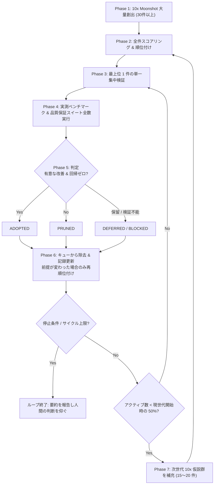

# Fail-Fast Moonshot Research Loop

未解決・高難度の計算問題に対して、10倍のブレークスルーを狙う仮説を大量に出し、1件ずつ実測で検証して素早く採否を決め、キューが枯れる前に補充し続ける研究開発ループである。

このファイルが定めるのは **ループの規律そのもの** である。対象プロジェクト固有の値（パス、検証コマンド、Ground Truth、目標）は次節の「プロジェクト設定」に集約してあり、**そこだけ差し替えれば別の問題にも使える**。本文中でパスやコマンドを参照するときは、常にこの表の値を指す。

---

## プロジェクト設定 (Project Configuration)

| 項目 | 現在の値（sister-problem / OEIS A007764） |
| :--- | :--- |
| 最終目標 | $a(28)$ の完全計算（$n \times n$ 格子の自己回避経路数） |
| 品質保証コマンド | `python math/src/verify_all.py` |
| Tier 定義の正本 | `VERIFICATION.md` / `QUALITY_ASSURANCE.md` |
| Ground Truth | OEIS A007764 の既知値 $a(1) \dots a(10)$（Tier 1 で完全一致を照合） |
| 仮説トラッカー | `MOONSHOT_TRACKER.md` |
| 分類マスター | `math/BREAKTHROUGH_TAXONOMY.md` |
| ベンチマーク台帳 | `math/BREAKTHROUGH_BENCHMARKS.md` |
| 実験スクリプト置き場 | `math/src/exp_h<NN>_<名前>.py` |
| 作業ブランチ | `Antigravity/*`（`AGENTS.md` 準拠。コミットごとに push する） |

---

## コア規律 (Core Disciplines)

### 1. 成果を Part 1 / Part 2 に分類する (Scope Distinction)

判定基準は 1 つだけである — **その主張は、任意の $n \in \mathbb{N}$ と任意の実行環境で成り立つか？**

- **Part 1（普遍）**: 成り立つもの。$n$ にもビット幅にもハードウェアにも依存しない数学的定理、可換性証明、大域的アルゴリズム。
- **Part 2（特定条件）**: 成り立たないもの。特定の $n$ の範囲、特定のビット幅、特定のハードウェア機能に依存する技術。
- **交差ケースの裁定**: 数学的には任意の $n$ で成り立つが、実装が特定のハードウェアに依存する場合は、**定理を Part 1、実装を Part 2 として 2 件に分けて記録する**。どちらか一方に押し込むと、後から「理論のうちどこまでが機材に依存しない資産なのか」が読めなくなる。
- 例 — Part 1: 対称直和分解、商空間全単射ランキング、モツキン数公式、並列 CRT、行チェックポイント。Part 2: $n \le 28$ / $n \le 31$ 限定、11-bit 幅、64-bit Bitboard、SWAR ALU、L1 常駐テーブル、Tensor Core GEMM。

なぜ重要か: この 2 つを混ぜると、ハードウェア世代が変わった瞬間に何が残るのか分からなくなる。Part 1 は恒久的な資産、Part 2 は現在の機材に対する投資であり、寿命がまったく違う。

### 2. 1 件ずつの単一集中検証 (One-by-One Verification)

複数の仮説をまとめて雑に検証してはならない。アクティブキュー最上位の **単一仮説に 100% 集中** し、専用の実験スクリプトを作成して検証する。並行して手を出すと、どれも詰め切れないまま実測値が曖昧になり、採否の根拠が失われる。

### 3. 採否は実測値だけで決める (Empirical Evidence at the Decision Point)

- **適用範囲**: この規律は Phase 4 の測定と Phase 5 の採否判定に適用される。Phase 1 の発想と Phase 2 の順位付けは、まだ実装されていないアイデアを扱う以上どうしても見積りであり、そこに実測を要求するのは不可能である。**見積りと実測を混同しないこと自体が、この規律の要点である。**
- 判定の場面で「良さそうだ」「速くなりそうだ」を根拠にしてはならない。必ず実測値（実行時間、メモリバイト数、スループット ops/sec、削減率、Ground Truth 完全一致ログ）を測り、ベンチマーク台帳に記録する。
- 記録には **測定コマンドと生ログ** を含める。後から誰でも同じ手順で追試できることが、この台帳の唯一の存在理由である。
- Phase 2 で見積った Impact 倍率と Phase 4 の実測倍率が食い違った場合、**台帳には実測値をそのまま書く**。見積りに合わせて実測を書き換えてはならない。両者の差そのものが、次世代の見積り精度を上げる情報になる。

### 4. 品質保証スイートを毎回全数実行する (Zero-Regression Baseline)

コード変更時と仮説の採用時は、必ず品質保証コマンドを実行し、欠陥ゼロ（Zero Defects）で通過することを確認する。スイートは **固定部と可変部** に分かれる。

- **Tier 0〜5（固定・6 段）**: Tier 0 静的解析・バイトコードコンパイル / Tier 1 Ground Truth 数値一致 / Tier 2 マルチ幅 Packed DP & CRT 不変性 / Tier 3 上界整合性 $Z(n) \ge a(n)$ / Tier 4 幾何対称性・mod-4 不変量 / Tier 5 状態次元定理・全単射ランキング証明。定義の正本は Tier 定義ファイルを参照する。
- **Bonus（可変・必要に応じて追加）**: 固定 Tier では捕まえられない回帰リスクを持ち込む採用物に **だけ** 、専用の検証を 1 つ追加する。採用のたびに機械的に増やすものではない（実績では 19 件の採用に対し Bonus は 4 つ）。
  - **追加する**: 答えに至る独立した計算経路を新設したもの、または新しい不変量を主張するもの。壊れたときに例外ではなく「静かに違う数値」が出るため、固定 Tier だけでは検出できない。例: Bonus 1 = H-31 Bitboard エンジン、Bonus 2 = H-02 対称分解定理、Bonus 3 = H-34 商ランキング全単射、Bonus 4 = H-35 並列 CRT 復元。
  - **追加しない**: 数値を一切変えない純粋な高速化（SIMD 化、キャッシュ配置、分岐除去など）。既存 Tier が同じ答えを照合するので、そこで回帰は捕まる。検証を重複させても実行時間が延びるだけである。
  - どちらに判断した場合も、**その理由を採用時の記録に 1 行残す**。「速いだけなので不要」と判断した履歴が無いと、後から見て抜け漏れなのか意図的なのか区別できない。

「5-Tier」は Tier 1〜5 の 5 段を指す通称である。Tier 0 は入口の静的ゲート、Bonus は必要に応じてのみ増える可変枠なので、**スイートの総段数は固定ではない**。段数を数え間違えて「全部通った」と判断しないこと。

### 5. 10x は思想であり、採用の閾値ではない (10x as Ambition, Not as Gate)

- Phase 1 で仮説を出す際は 10 倍を狙う。照準を下げると発想そのものが小さくなるため、**生成時の要求水準は高く保つ**。10x はこのループの思想であって、合否ラインではない。
- 一方で、**採用判定において 10 倍を要求してはならない**。現実の高速化は 2〜3 倍の積み上げで達成される。3 倍が 3 段重なれば 27 倍であり、「10 倍未満だから捨てる」という規則はこの積み上げを原理的に不可能にする。
- **ADOPT の条件** — 次の 2 つを両方満たすこと:
  1. 実測で有意な改善がある。既定の下限は **中央値で 1.15 倍以上**、かつ実行間のばらつきを明確に超えていること。速度以外（メモリ削減、到達可能な $n$ の拡大、精度向上）でも同様に実測値で示す。
  2. 品質保証スイートが欠陥ゼロで通過する（回帰ゼロ）。
- **PRUNE の条件** — 次のいずれかに該当すること:
  1. 理論的破綻が判明した（エイリアシング、結合次元爆発、素数密度不足等）。
  2. 実測が改善なし、または悪化しており、かつ有意な改善への経路が見えない。
  3. 正当性を壊す（Ground Truth 不一致、回帰の発生）。
- **「10 倍に届かなかった」ことは、それ単独では PRUNE の理由にならない。** 1.5 倍でも回帰ゼロなら採用し、台帳には実測倍率をそのまま記録する。誇張された 10x より正確な 1.5x のほうが、後続の積み上げの土台として価値が高い。

### 6. アクティブキューを正しく保ち、50% で補充する (Queue Hygiene & Replenishment)

- **判定が確定した仮説は、その場でアクティブキューから外す。** ADOPTED や PRUNED がキューに残っていると、アクティブ数が実態より多く見え、補充が遅れて枯渇する。取りこぼしやすいので、Phase 6 で必ず確認する。
- **アクティブ数の定義**: 状態が `QUEUED` または `DEFERRED` の仮説の件数。`ADOPTED` / `PRUNED` / `BLOCKED` は数えない。
- **補充の閾値**: アクティブ数が **現世代の開始時点の件数の半分** を下回ったら補充する。$M_0 = 30$ で始まり第 2 世代で 15 件補充したなら、次の閾値は「第 2 世代の開始件数の半分」であって、いつまでも 15 ではない。閾値を固定値に読み替えると、世代が進むほど補充が遅れる。
- **補充の内容**: 直前の世代で得られたブレークスルーと幾何学的知見を土台に、新たな 10x 仮説を 15〜20 件創出し、既存の残存分と合わせて全件を再スコアリングする。
- 補充後は世代番号を 1 つ進め、トラッカーに **現世代の開始件数と次の閾値** を明記する。

---

## 判定状態 (Verdicts)

Phase 5 の結論は次の 4 状態のいずれかである。二値（採用か切り捨てか）に押し込むと、「失敗したが有用な補題が出た」「必要な機材が無い」「まだ結論が出ていない」という頻出の現実に行き場が無くなり、キューが詰まる。

| 状態 | 意味 | キュー | 必須の記録 |
| :--- | :--- | :--- | :--- |
| `ADOPTED` | 実測で有意な改善 + 回帰ゼロ | 外す | 台帳に実測値、分類マスターに Part 1/2、Bonus 検証の要否とその理由 |
| `PRUNED` | 理論的破綻 / 改善経路なし / 正当性破壊 | 外す | 切り捨て理由を 1 行で。**副産物（証明できた補題、確定した限界値）があれば必ず併記する** |
| `DEFERRED` | 筋は良いが、依存する別の仮説が未検証 | 残す（再スコアリング対象） | 何を待っているか、解除条件 |
| `BLOCKED` | 必要な機材・データ・環境が無く検証不能 | 外す（別リストへ） | 何が足りないか。入手できれば復帰させる |

**タイムボックス**: 1 つの仮説に費やすのは 1 サイクル分までとする。1 サイクル終えても採否が決まらなければ `DEFERRED` にして次へ移る。結論の出ない検証に張り付き続けることは、Fail Fast の規律そのものに反する。

`PRUNED` の副産物を捨てないこと。「この方向は 2.0x が限界だと確定した」という否定的結果は、後続の仮説から同じ袋小路を消すため、採用と同等の価値を持つことがある。

---

## Phase 2 のスコアリング基準 (Prioritization)

全アクティブ仮説を次式で採点し、降順に並べる。

$$S = \frac{\text{Impact} \times \text{Velocity}}{\text{Complexity}}$$

| 軸 | 範囲 | 意味 | 見積りの根拠に書くこと |
| :--- | :---: | :--- | :--- |
| **Impact** | 10〜100 | 成功した場合に期待される改善倍率（10 = 10x、100 = 100x） | 理論的な上限見積り。「状態空間が半分になる」等の根拠を 1 行で |
| **Velocity** | 1〜10 | 検証の速さ。10 = 数分で決着、1 = 数日がかり | 既存コードの再利用度、必要な実装量 |
| **Complexity** | 1〜10 | 実装と正当性証明の難度。1 = 自明、10 = 未解決研究級 | 依存する未証明の前提の数 |

**Impact は「見積り」であって「実測」ではない。** ここに書く 10x / 50x は順位付けのための事前予測であり、採否の根拠にはならない（規律 3 と 5 を参照）。Phase 4 の実測倍率は必ず台帳側に書き、Impact 欄と食い違ったままにしてよい。

再スコアリングを行うのは、(a) ADOPTED の成果が他の仮説の前提を変えたとき（Phase 6）、(b) 補充を行ったとき（Phase 7）の 2 つの場合だけである。毎サイクル全件を採点し直す必要はない。

---

## 実行ライフサイクル (7 Phases)

各フェーズの入退場条件は次のとおり。図はあくまで概観であり、実行の判断はこの表に従う。

| Phase | 開始条件 | やること | 成果物 | 完了条件 |
| :--- | :--- | :--- | :--- | :--- |
| **1. 創出** | ループ開始時、または Phase 7 から | 10x を狙う仮説を 30 件以上創出する | 仮説リスト（ID・名称・狙う倍率とその根拠） | 30 件以上がトラッカーに記載された |
| **2. 順位付け** | 未採点の仮説がある | 全アクティブ仮説を $S$ 式で採点し降順に並べる | トラッカーのランク表 | 全アクティブ仮説に順位がついた |
| **3. 単一検証** | 順位付き非空キュー | 最上位 1 件だけに集中し、専用の実験スクリプトを書く | `math/src/exp_h<NN>_*.py` | スクリプトが実行でき、結果が出た |
| **4. 測定** | 実験スクリプトが動く | 実測値を取り、品質保証スイートを全数実行する | 実測ログ（コマンド + 生ログ） | 改善倍率と全 Tier の結果が揃った |
| **5. 判定** | Phase 4 の数値が揃った | 判定状態の表に従い 4 状態のいずれかを決める | 判定と理由 | 状態が確定した |
| **6. 記録** | 判定が確定した | キューから除去し、記録 3 ファイルを更新。ADOPTED なら Bonus 検証の要否を判断して記録。前提が変わった場合のみ再順位付け | 更新された記録 3 ファイル | 3 ファイルが判定を反映している |
| **7. 補充** | アクティブ数が現世代開始時の 50% 未満 | 15〜20 件を創出し、世代番号を進める | 次世代の仮説群 | 補充後、Phase 2 へ戻る |

---

## 停止条件と 1 回の呼び出し単位 (Stop Conditions)

このループは、放置すると終わらない。Phase 7 が Phase 2 へ戻り続けるためである。人間が方向を修正する機会を作るため、以下の停止規則を必ず守る。

**1 回の呼び出しで回すサイクル数**: 既定 **3 サイクル**（1 サイクル = Phase 3〜6 の 1 周）。ユーザーが回数や時間を指定した場合はそれに従う。上限に達したら、他の条件に関わらずループを抜けて報告する。

**サイクル上限の前でも、次のいずれかに該当した時点で即座に抜ける**:

1. **目標達成**: その世代に設定した目標（例: $a(28)$ の完全計算、所要時間の目標値）を満たした。
2. **枯渇**: アクティブ仮説が 0 件になり、補充しても既出の焼き直ししか出てこない。
3. **連続空振り**: 5 サイクル連続で ADOPTED が 0 件。仮説の質か評価基準のどちらかが壊れている疑いが強く、回し続けるより人間に相談したほうが速い。
4. **検証不能の連鎖**: 上位 3 件が続けて `BLOCKED` になった。キューの順位付けが手元の環境と乖離している。
5. **回帰の未解消**: 品質保証スイートが落ちた状態を 1 サイクル以内に緑へ戻せない。緑に戻すことが新規仮説の検証より優先する。
6. **予算超過**: ユーザーが指定した時間・計算資源の上限に達した。

**終了時の報告に必ず含めるもの**: 回したサイクル数 / ADOPTED と PRUNED の件数と対象 / 得られた実測値の要点 / 残存アクティブ数と次の補充閾値 / 次に検証すべき最上位仮説とその理由。

ループを止めることは失敗ではない。上記 3〜5 は「回し続けても成果が出ない状態」を早期に検出するための停止点であり、Fail Fast の規律をループ自身に適用したものである。

---

## 記録ファイル規約

パスはプロジェクト設定の表を参照する。

1. **仮説トラッカー**: 全仮説の順位、判定状態、切り捨て理由、採用実績を動的に更新する。冒頭に現世代の開始件数・アクティブ数・次の補充閾値を明記する。
2. **分類マスター**: **Part 1（普遍的）** と **Part 2（特定条件）** に完全分離した体系。規律 1 の裁定ルールに従って記載する。
3. **ベンチマーク台帳**: 全ブレークスルーの実測値・実行時間・スループット・検証ログの公式記録。

**共通規約**: 実験スクリプトや資料へのリンクは、必ず **リポジトリ相対パス** で書く。ローカルの絶対パスで書くと他の環境から辿れなくなり、「誰でも追試できる」という台帳の目的（規律 3）が失われる。
