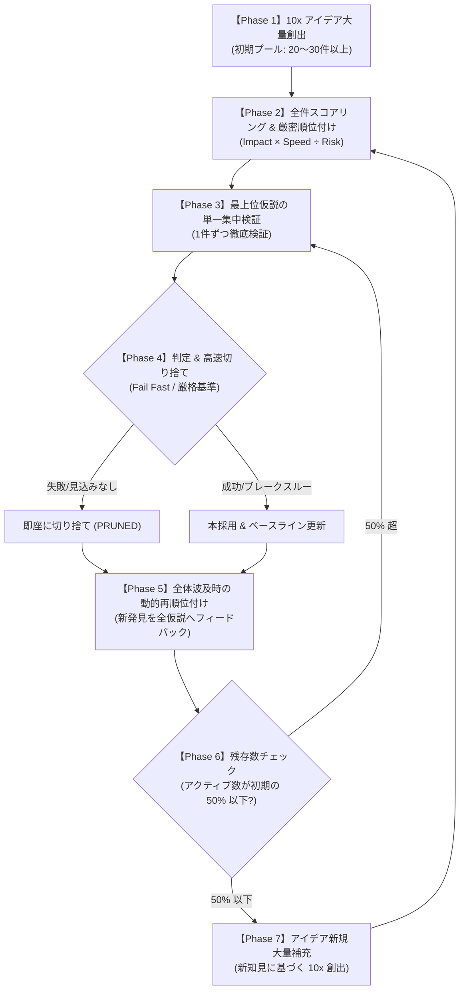

# Fail-Fast Moonshot Loop（10倍思考・高速検証・自律補充サイクル）

本スキルは、未解決問題や極限の最適化課題（例：OEIS A007764 $a(28)$ の計算など）において、
**「仮説は大抵失敗する」という大前提に立ち、10倍（10x）以上の非連続な飛躍をもたらすアイデアを大量に生み出し、最も速く検証・選別・補充し続けるための自律的探求サイクル** です。

---

## 探求プロセスの全体フロー



---

## 実行フェーズ詳細手順

### Phase 1: 10x アイデアの大量創出（Hypothesis Generation）
- **原則**: 定数倍（10%〜20%）の小改善は除外し、**計算量・メモリ・速度を 10倍〜100倍 飛躍させるアイデア** のみを対象とする。
- **必須記述項目**: 各アイデアには必ず以下を定義する：
  1. **【名称 & 核となる着想（What）】**
  2. **【10倍の飛躍をもたらすメカニズム（Why 10x）】**
  3. **【想定される失敗モード・落とし穴（Failure Modes）】**
  4. **【最短で白黒つける即時検証プロトコル（Fast Verification Protocol）】**

### Phase 2: 全件スコアリング & 厳密順位付け（Global Prioritization）
全仮説に対し、以下の数式で優先度スコア $S$ を算出し、1位から最下位まで完全順位付けする：

$$S = \frac{\text{Impact（期待倍率: 10〜100）} \times \text{Velocity（検証速度: 1〜10）}}{\text{Complexity（検証難易度: 1〜10）}}$$

- $S$ の値が大きい順（＝最も短時間で最大のインパクトを検証できるもの）からキューに並べる。

### Phase 3: 単一集中検証（Sequential Single-Hypothesis Verification）
- キューの最上位にある仮説（Rank 1）**1件のみ** にリソースを集中して実験・検証スクリプトを作成・実行する。
- 複数仮説の同時並行は避け、結果を濁らせない。

### Phase 4: 高速切り捨て（Fail Fast & Strict Pruning）
- **徹底した合否基準**: プロジェクトの品質基準（例：`VERIFICATION.md` の 5-Tier テスト等）に基づき、冷徹に合否を判定する。
- **撤退基準**:
  - 数学的矛盾、不可逆性、または実験結果が理論予測（10x）を満たさない場合は、**一切未練を持たずに即座に「PRUNED（切り捨て）」** とする。
  - 切り捨てた理由と知見を簡潔にログへ記録する。

### Phase 5: 全体波及時の動的再順位付け（Dynamic Re-Ranking）
- 1つの検証で得られた知見（例：「テンソル階数は満杯で圧縮不可」「対称群で奇数パリティ排除可能」など）が他の仮説の成否・前提に影響を与える場合：
  - **残存する全仮説のスコアと順位を即座に再計算・再編成** する。

### Phase 6 & 7: 50% 閾値での自動補充（Replenishment at 50% Threshold）
- **補充トリガー**: 未検証のアクティブ仮説数が **「初期仮説数の 50%」** を下回った瞬間に発動。
- **補充アクション**:
  - これまでの検証で得られた「成功パターン」「失敗から得た制約条件」を入力として、**新たな 10x アイデアを大量発想し、プールを初期値以上に補充** する。
  - 新仮説を再度スコアリングし、キューを再編成して Phase 3 へ戻る。

---

## 運用ルールとログ形式

探求の進行状況は、常にリポジトリ内の `MOONSHOT_TRACKER.md` 等で可視化・管理する：

```markdown
### Active Queue (Total: N, Initial Baseline: M)
1. [Rank 1] H-XX: 名称 (Score: S) -> [Status: TESTING]
2. [Rank 2] H-YY: 名称 (Score: S) -> [Status: QUEUED]

### Pruned Archive (Failed Fast)
- [PRUNED] H-ZZ: 切り捨て理由（理由の要約）

### Adopted Breakthroughs
- [ADOPTED] H-AA: 達成された成果とベースライン更新内容
```
