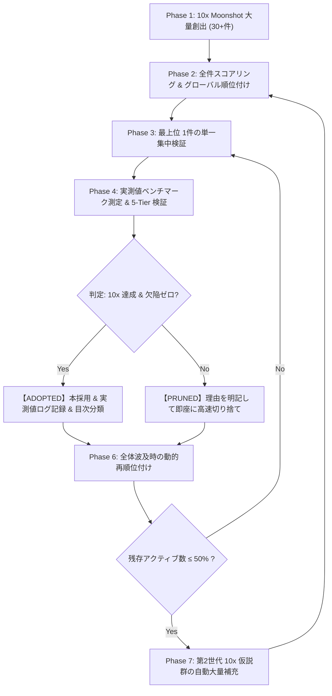

# Fail-Fast Moonshot Research Loop Skill

このスキルは、未解決問題（OEIS A007764 等）に対し、10倍以上のブレークスルーをもたらすアイデアを大量創出し、1件ずつ徹底的に集中検証して高速に切り捨てる（Fail Fast）または本採用（Adopt）する研究開発ループの実行手順を定めます。

---

## コア規律 (Mandatory Disciplines)

1. **1件ずつの単一集中検証（One-by-One Verification）**:
   - 複数の仮説を雑にまとめて検証してはならない。
   - 必ずアクティブキュー最上位の **単一仮説（Single Hypothesis）に 100% 集中** し、専用の実験スクリプトを作成して検証する。

2. **実測値による定量的証跡の必須記録（Empirical Benchmark Logging）**:
   - 「良さそうだ」「速くなりそうだ」という定性的な評価は一切禁止する。
   - 必ず **実測値（実行時間、メモリバイト数、スループット ops/sec、削減率、Ground Truth 完全一致ログ）** を測定し、後から誰でも追試できるように `math/BREAKTHROUGH_BENCHMARKS.md` に記録する。

3. **5-Tier 品質保証スイートの都度全数実行（Zero-Regression Baseline）**:
   - 仮説の採用時およびコード変更時は、必ず `python math/src/verify_all.py` を実行し、全 Tier（Tier 0〜5 + Bonus）が欠陥ゼロ（Zero Defects）で通過することを確認する。

4. **高速切り捨て（Fail Fast on Deficiency）**:
   - 10倍の飛躍をもたらさないもの、理論的破綻（エイリアシング、結合次元爆発、素数密度不足等）が判明したものは即座に `PRUNED` アーカイブへ隔離する。

5. **50% 閾値での自動大量補充（Replenishment at 50% Active Threshold）**:
   - アクティブ仮説数が初期値（$M_0 = 30$）の半分（15件）を切った時点で、得られたブレークスルーや幾何学的知見を土台として、新たな 10x 仮説群（15〜20件）を自動大量補充し、全件再スコアリングを行う。

---

## 7フェーズ実行ライフサイクル

---

## 記録フォーマット規約

### 1. `MOONSHOT_TRACKER.md`
アクティブキューの順位（スコア $S = \frac{\text{Impact} \times \text{Velocity}}{\text{Complexity}}$）、切り捨てアーカイブ、本採用ブレークスルー一覧を管理。

### 2. `math/BREAKTHROUGH_BENCHMARKS.md`
各ブレークスルーの：
- **名称と ID**
- **何がどう成果になるか（数理・技術的メカニズム）**
- **測定スクリプトパス**
- **実測ベンチマーク数値（時間、メモリ、スループット、対従来比）**
- **Ground Truth 検証ログ**
を完全網羅して記録する。
