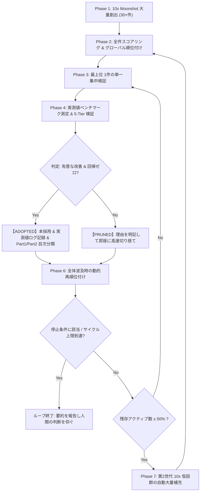

# Fail-Fast Moonshot Research Loop Skill

このスキルは、未解決問題（OEIS A007764 等）に対し、10倍以上のブレークスルーをもたらすアイデアを大量創出し、1件ずつ徹底的に集中検証して高速に切り捨てる（Fail Fast）または本採用（Adopt）する研究開発ループの実行手順を定めます。

---

## コア規律 (Mandatory Disciplines)

1. **成果の 2分法分類ルール (Scope Distinction Mandate)**:
   - **Part 1（普遍的数理定理・大域的アルゴリズム）**:
     - 任意の $n \in \mathbb{N}$ で恒常的に成り立つ数学的定理、可換性証明、大域的アルゴリズム（対称直和分解、商空間全単射ランキング、モツキン数公式、並列CRT、行チェックポイント等）は必ず **Part 1** へ分類・記録する。
   - **Part 2（局所最適化・特定境界条件特化技術）**:
     - $n \le 28$（または $n \le 31$）、特定の素数幅（11-bit）、特定のハードウェア構造（64-bit Bitboard, SWAR ALU, L1キャッシュ常駐テーブル, Tensor Core GEMM等）など、**特定の状況でしか成り立たない技術は必ず Part 2** へ分類・記録する。

2. **1件ずつの単一集中検証（One-by-One Verification）**:
   - 複数の仮説をまとめて雑に検証してはならない。
   - 必ずアクティブキュー最上位の **単一仮説（Single Hypothesis）に 100% 集中** し、専用の実験スクリプトを作成して検証する。

3. **実測値による定量的証跡の必須記録（Empirical Benchmark Logging）**:
   - 「良さそうだ」「速くなりそうだ」という定性的な評価は一切禁止する。
   - 必ず **実測値（実行時間、メモリバイト数、スループット ops/sec、削減率、Ground Truth 完全一致ログ）** を測定し、後から誰でも追試できるように `math/BREAKTHROUGH_BENCHMARKS.md` に記録する。

4. **5-Tier 品質保証スイートの都度全数実行（Zero-Regression Baseline）**:
   - 仮説の採用時およびコード変更時は、必ず `python math/src/verify_all.py` を実行し、全 Tier（Tier 0〜5 + Bonus）が欠陥ゼロ（Zero Defects）で通過することを確認する。

5. **10x は発想の照準であり、採用の閾値ではない (10x as Ambition, Not as Gate)**:
   - Phase 1 で仮説を出す際は 10 倍を狙う。照準を下げると発想そのものが小さくなるため、生成時の要求水準は高く保つ。
   - 一方で、**採用判定において 10 倍を要求してはならない**。現実の高速化は 2〜3 倍の積み上げで達成される。3 倍が 3 段重なれば 27 倍であり、「10 倍未満だから捨てる」という規則はこの積み上げを原理的に不可能にする。
   - **ADOPT（本採用）の条件** — 次の 2 つを両方満たすこと:
     1. 実測で有意な改善がある。既定の下限は **中央値で 1.15 倍以上**、かつ実行間のばらつきを明確に超えていること。速度以外（メモリ削減、到達可能な $n$ の拡大、精度向上）でも同様に実測値で示す。
     2. `python math/src/verify_all.py` が欠陥ゼロで通過する（回帰ゼロ）。
   - **PRUNE（切り捨て）の条件** — 次のいずれかに該当すること:
     1. 理論的破綻が判明した（エイリアシング、結合次元爆発、素数密度不足等）。
     2. 実測が改善なし、または悪化しており、かつ有意な改善への経路が見えない。
     3. 正当性を壊す（Ground Truth 不一致、回帰の発生）。
   - **「10 倍に届かなかった」ことは、それ単独では PRUNE の理由にならない。** 1.5 倍でも回帰ゼロなら採用し、`math/BREAKTHROUGH_BENCHMARKS.md` には実測倍率をそのまま記録する。誇張された 10x より正確な 1.5x のほうが、後続の積み上げの土台として価値が高い。
   - 切り捨てたものは、理由（上記のどれに該当したか）を明記して `PRUNED` アーカイブへ隔離する。

6. **50% 閾値での自動大量補充（Replenishment at 50% Active Threshold）**:
   - アクティブ仮説数が初期値（$M_0 = 30$）の半分（15件）を切った時点で、得られたブレークスルーや幾何学的知見を土台として、新たな 10x 仮説群（15〜20件）を自動大量補充し、全件再スコアリングを行う。

---

## 7フェーズ実行ライフサイクル

---

## 停止条件と 1 回の呼び出し単位 (Stop Conditions)

このループは、放置すると終わらない。Phase 7 が Phase 2 へ戻り続けるためである。人間が方向を修正する機会を作るため、以下の停止規則を必ず守る。

**1 回の呼び出しで回すサイクル数**: 既定 **3 サイクル**（1 サイクル = Phase 3〜6 の 1 周）。ユーザーが回数や時間を指定した場合はそれに従う。上限に達したら、他の条件に関わらずループを抜けて報告する。

**サイクル上限の前でも、次のいずれかに該当した時点で即座に抜ける**:

1. **目標達成**: その世代に設定した目標（例: $n = 28$ の完全計算、所要時間の目標値）を満たした。
2. **枯渇**: アクティブ仮説が 0 件になり、補充しても既出の焼き直ししか出てこない。
3. **連続空振り**: 5 サイクル連続で ADOPTED が 0 件。仮説の質か評価基準のどちらかが壊れている疑いが強く、回し続けるより人間に相談したほうが速い。
4. **検証不能の連鎖**: 上位 3 件が続けて「必要な環境・データ・ハードウェアが無く検証不能」となった。キューの順位付けが現実と乖離している。
5. **回帰の未解消**: `verify_all.py` が落ちた状態を 1 サイクル以内に緑へ戻せない。緑に戻すことが新規仮説の検証より優先する。
6. **予算超過**: ユーザーが指定した時間・計算資源の上限に達した。

**終了時の報告に必ず含めるもの**: 回したサイクル数 / ADOPTED と PRUNED の件数と対象 / 得られた実測値の要点 / 残存アクティブ数 / 次に検証すべき最上位仮説とその理由。

ループを止めることは失敗ではない。上記 3〜5 は「回し続けても成果が出ない状態」を早期に検出するための停止点であり、Fail Fast の規律をループ自身に適用したものである。

---

## 記録ファイル規約

1. `MOONSHOT_TRACKER.md`: 全仮説の順位、切り捨て、採用状況を動的更新。
2. `math/BREAKTHROUGH_TAXONOMY.md`: **Part 1（普遍的）** と **Part 2（特定状況）** に完全分離したマスター体系。
3. `math/BREAKTHROUGH_BENCHMARKS.md`: 全ブレークスルーの実測値・実行時間・スループット・検証ログ公式記録。
