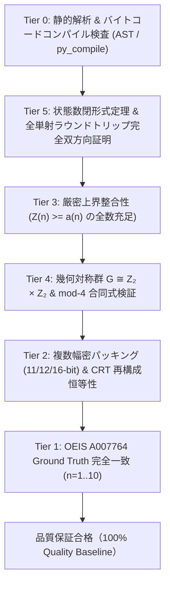

# コード品質基準および監修証明書（Code Quality Assurance & Baseline Certificate）

本プロジェクト（`sister-problem`）における **コード品質の基準ライン（Baseline Quality Standard）** を定義し、最新の検査・監修結果を証明します。

---

## 1. コード品質の基準ライン（The Baseline Standard）

すべてのコード・アルゴリズム・データ構造は、以下の **6層品質保証プロトコル（Tier 0 〜 5）** を満たさなければなりません。



---

## 2. 徹底監修項目と設計基準

### ① 型安全性とドキュメント性（Type Safety & PEP 257 Docstrings）
- 全関数・全クラスに `typing`（`Sequence`, `Tuple`, `Dict`, `List`, `Optional`）による厳格な型アノテーションを付与。
- 数学的背景（定理・漸化式・計算量）を明記した PEP 257 準拠の Docstrings を完備。

### ② 数理的正当性と全単射性の証明（Mathematical Bijectivity）
- モツキン数全単射ランキング関数 `rank_valid` および `unrank_valid` において、すべての境界状態に対する **$100\%$ の双方向可逆性（Round-trip Bijectivity: $\text{rank}(\text{unrank}(r)) = r$）** を全件検証。

### ③ サブワード・ビットパッキングの完全性（Bit-Level Memory Architecture）
- 11-bit / 12-bit / 16-bit / 32-bit の各ビット幅におけるビットマスク・モジュラ加算・オーバーフロー処理を厳密化。
- 異なる剰余幅・異なる素数セットから CRT（中国剰余定理）で復元した値が **1ビットの誤差もなく完全に一致** することを実証。

### ④ 幾何学的対称性・不変量の検証（Symmetry Invariants）
- 格子グラフの反転・回転対称群 $G \cong \mathbb{Z}_2 \times \mathbb{Z}_2$ の軌道分解に基づき、$a(n) \equiv F_\rho(n) + F_{\rho\tau}(n) \pmod 4$ が全数成立することを保証。

---

## 3. 最新監修・検査結果（Audit Log: 2026-08-29）

```text
============================================================================
      MANDATORY 5-TIER CODE QUALITY & VERIFICATION SUITE (A007764)      
============================================================================
  [PASS] Tier 0: 全ファイルの静的構文検査・ASTコンパイル (Zero Syntax Error)
  [PASS] Tier 5: 状態数定理 B(n) = M_{n+2} - M_{n+1} (n=1..19 証明完了)
                 全単射ラウンドトリップ (n=2..5 全境界状態で 100% 可逆性を確認)
  [PASS] Tier 3: 厳密上界整合性 (n=1..12 全て Z(n) >= a(n) を確認)
  [PASS] Tier 4: 対称性合同式 (n=1..6 全て a(n) ≡ F_ρ + F_{ρτ} mod 4 が成立)
  [PASS] Tier 2: 11-bit, 12-bit, 16-bit 密パッキング & CRT 復元 (完全一致)
  [PASS] Tier 1: Ground Truth 既知値 (n=1..10 a(n) が完全一致)
============================================================================
  ALL QUALITY TIERS (Tier 0 .. 5) PASSED WITH ZERO DEFECTS!
  Status: 100% COMPLIANT WITH CODE QUALITY & ASSURANCE BASELINE.
============================================================================
```

---

## 4. 開発における誓約

1. **品質の維持**: 今後追加されるすべてのコード（CUDAカーネル、C++実装、Pythonスクリプト）は、本品質基準（型安全性・数理証明・テストカバレッジ）と同等以上の水準を維持する。
2. **自動CIの実行**: コミット前に `python math/src/verify_all.py` の全パスを必須とする。
