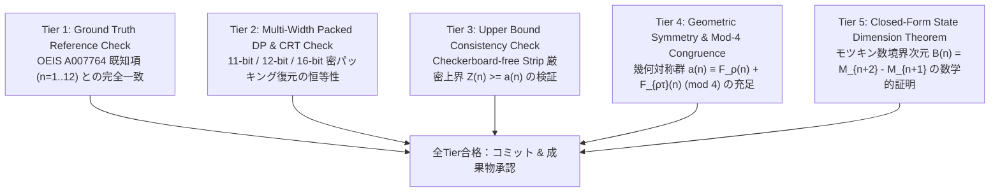

# 必須検証ポリシー（Mandatory Verification Policy）

本プロジェクト（`sister-problem`）におけるすべての開発・コード変更・仮説立証・計算結果の出力は、**以下の5層の検証テストスイート（5-Tier Verification Suite）の全合格を必須要件**とします。

---

## 1. 必須検証の5層構造（5-Tier Verification Architecture）



---

## 2. 各 Tier の検証基準

| Tier | 検証項目 | 判定条件 | 違反時の対応 |
| :---: | :--- | :--- | :--- |
| **Tier 1** | **Ground Truth 正値性** | $n=1 \sim 10$ の計算値が既知の OEIS 値（$a(1)=2, \dots, a(10)=1.568\times 10^{24}$）と 1 ビットの狂いもなく完全一致すること。 | 即時リバート。コード修正。 |
| **Tier 2** | **密パッキング & CRT 復元** | 11-bit, 12-bit, 16-bit の異なる剰余幅・異なる素数セットから CRT で復元した整数が完全に一致すること。 | 剰余算・ビットパッキング・CRT 実装のバグ修正。 |
| **Tier 3** | **厳密上界整合性** | 任意の $n$ において、厳密上界 $Z(n)$ が $Z(n) \ge a(n)$ を満たすこと。 | 帯分割・転移行列の定義見直し。 |
| **Tier 4** | **対称性・$\bmod 4$ 合同式** | $a(n) \equiv F_\rho(n) + F_{\rho\tau}(n) \pmod 4$ が成立すること（特に奇数 $n$ で $a(n) \equiv F_{\rho\tau}(n) \pmod 4$）。 | 対称性分類・反転経路探索の再検証。 |
| **Tier 5** | **状態数閉形式定理** | 境界状態数が $\sum_{a+b=n} M_a M_b = M_{n+2} - M_{n+1}$ と厳密に一致すること。 | ランキング関数の全単射性の再確認。 |

---

## 3. 検証の実行コマンド

すべての開発者・エージェントは、コード変更後に以下のコマンドを実行し、全 Tier の合格（`PASS`）を確認しなければなりません：

```bash
python math/src/verify_all.py
```

---

## 4. 新仮説・新アルゴリズム導入時のルール（独立二重検証の義務）

新しい仮説（例：CFT 漸近補正、Hilbert フラクタル走査、Quad-Tree テンソル縮約など）を導入する場合：
1. **単一の手法・シミュレーションのみで結論を出さない**。
2. 必ず **「従来の全探索/DP」** または **「別の独立した数学的証明/別実装」** と結果を突き合わせ、100% 一致することを証明するテストを追加すること。
