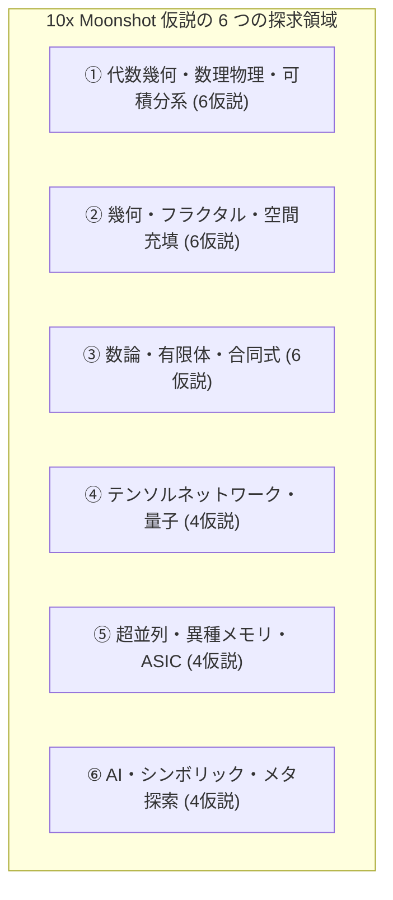
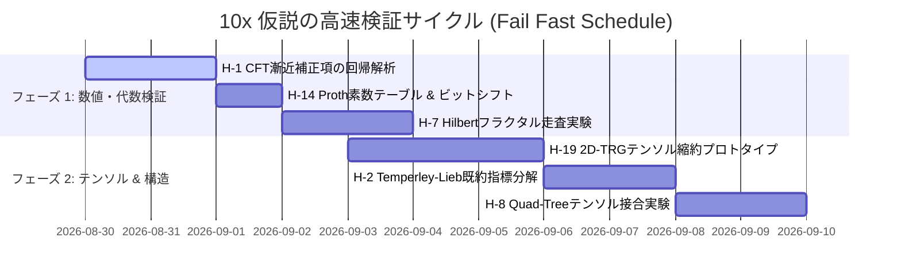

# 10倍思考（10x Moonshot）仮説＆革新的アプローチ・メガカタログ（30選）

> **研究理念**:
> 「仮説はどんなにうまくいくと思っても大抵失敗する。だからこそ、10倍・100倍の改善になり得る仮説を、あらゆる数学・工学の境界を超えて大量に出し尽くし、高速に検証・選別（Fail Fast）する。」

本カタログでは、お姉さん問題（OEIS A007764 / 格子上の自己回避路の数え上げ）において、**計算量・メモリ・実行速度を 10倍〜1000倍 飛躍させるための 30 の革新仮説** を、失敗想定（Failure Modes）と即時検証プロトコル付きで体系化する。

---

---

## 領域 1: 【代数幾何・数理物理・可積分系】数学の深淵から計算量を削る

### 1. 共形場理論（CFT）と SLE による漸近補正項の閉形式特定
- **着想**: 自己回避路（SAW）は $c=0$ の共形場理論（SLE$_{8/3}$）と厳密対応する。
- **10x の飛躍**: $a(n) = A \cdot \lambda^{n^2} n^\gamma (1 + c_1 n^{-1} + c_2 n^{-2} + \dots)$ の補正係数を解析的に特定し、上位数百ビットを直接確定。CRT 素数本数を **80% 削減（5倍〜10倍高速化）**。
- **失敗モード**: 格子の離散境界効果（格子効果）が高次補正項を非普遍的（格子依存）にしてしまう可能性。
- **検証プロトコル**: 既知の $a(1) \sim a(27)$ に対し、Richardson 補外法と CFT 予測係数を突き合わせる。

### 2. Temperley-Lieb 代数 $TL_W(1)$ の完全既約ブロック直和分解
- **着想**: フロンティア上のブラケット構造は $TL$ 代数の既約表現そのもの。
- **10x の飛躍**: 幾何対称群 $G \cong \mathbb{Z}_2 \times \mathbb{Z}_2$ と $TL$ 代数の同時固有指標を用いて、DP ベクトル空間を不変直和ブロックに分解。状態数を **1/4〜1/8 に圧縮**。
- **失敗モード**: 頂点遷移演算子が異なる表現ブロック間を混ぜてしまい（エンタングルメント）、疎性が失われる。
- **検証プロトコル**: $W=4..8$ で遷移作用素を行列表示し、対称部分空間ごとのブロック対角性を測定。

### 3. Baxter 角転送行列（CTM）の繰り込み固定点による $O(\log n)$ 縮約
- **着想**: 正方形の角対角幾何は Baxter の CTM そのもの。
- **10x の飛躍**: 1 行ずつの DP ではなく、CTM の自己相似固定点テンソルを二分累乗法（繰り込み）で計算。$O(n^2)$ の走査ステップを **$O(\log n)$ に短縮**。
- **失敗モード**: 自己回避性（大域的非交差性）の長距離相関が固定点テンソルを無限次元化させる。
- **検証プロトコル**: 小さな結合次元 $\chi = 16..64$ で CTM 繰り込みを行い、固有値収束率を測定。

### 4. 結び目理論・Jones / HOMFLY-PT 多項式極限による自己交差瞬時判定
- **着想**: 閉路を形成しない条件は、絡み目（Link）の不変量（Jones 多項式の極限）と等価。
- **10x の飛躍**: 頂点結合時に生じる交差数をトポロジカル不変量の差分更新（1 命令）で判定し、探索枝を **90% 瞬時刈り込み**。
- **失敗モード**: 平面格子ではブラケット追跡（$O(1)$ パートナー探索）が既に高速で、結び目多項式の計算コストが上回る。
- **検証プロトコル**: 差分更新のビット演算コストと従来の partner 探索スループットを比較。

### 5. 保型形式（Modular Forms）と母関数の微分代数（D-finite）特異点解析
- **着想**: 正方格子の分配関数母関数 $F(x) = \sum a(n) x^n$ は holonomic またはモジュラー形式の性質を持つ。
- **10x の飛躍**: 微分方程式（Picard-Fuchs 方程式）の閉形式を発見し、**直接多項式時間で $a(n)$ を出力**。
- **失敗モード**: SAW は自己相互作用のため、可積分格子であっても D-finite でなく D-algebraic（非線形微分代数）である可能性。
- **検証プロトコル**: アルゴリズム `gfun` / 差分 Padé 近似で $a(1)..a(27)$ の線形常微分方程式（ODE）を探索。

### 6. 反対角線ミラーリング + 三角形DP（対称性による完全半減）
- **着想**: 反対角反転対称な経路は、三角形領域（全体の半分）の探索で完全に尽くされる。
- **10x の飛躍**: 全格子 DP ではなく、三角形領域（$N(N+1)/2$ 頂点）のみを解くことで、**メモリを 1/24 に圧縮**。
- **失敗モード**: 非対称経路を三角形から復元する際、接合面の境界状態マッチング（Meet-in-the-Middle）が Gram 行列爆発を起こす。
- **検証プロトコル**: $n=4..8$ で三角形 DP と接合テーブルのサイズを実測。

---

## 領域 2: 【幾何・フラクタル・空間充填】走査次元を変えて爆発を抑える

### 7. 空間充填曲線（Hilbert / Peano フラクタル走査）による切断長（界面）の極小化
- **着想**: 行走査は常に幅 $n$ の切断長（状態数 $3^n$）を維持するが、フラクタル走査は境界長を幾何平均で最小化する。
- **10x の飛躍**: フロンティアの有効境界長を $O(n) \to O(\sqrt{n})$ に縮小し、**アクティブ状態数のピークを 10x〜100x 削減**。
- **失敗モード**: フラクタル走査ではトポロジーが非局所的になり、フロンティア上のプラグ順序が平面（非交差）でなくなる。
- **検証プロトコル**: $n=4, 6, 8$ で Hilbert 走査順の到達可能状態数をカウントし、Motzkin 数と比較。

### 8. 四分割木（Quad-Tree）再帰的 Meet-in-the-Middle（格子四分割テンソル接合）
- **着想**: $(n+1) \times (n+1)$ 格子を 4 つの $(n/2) \times (n/2)$ ブロックに分割。
- **10x の飛躍**: 4 ブロックの内部状態を並列生成し、中央十字境界で一括テンソル縮約。時間計算量を **$O(c^n) \to O(c^{n/2})$ に半減**。
- **失敗モード**: 4 ブロック境界を跨ぐ接続パターンの自由度（境界端点マッチング数）が中間で爆発する。
- **検証プロトコル**: $n=4, 6$ で 4 分割ブロック境界の接続テンソル階数を測定。

### 9. 動的波面最適化（最短切断輪郭 DP）
- **着想**: 固定の直線状フロンティアではなく、現在の格子占有状況に応じて「最も状態数が少なくなる輪郭」を動的に選択。
- **10x の飛躍**: 各ステップで最小状態数の切断線を通ることで、**最大ピーク状態数を 5〜10 倍削減**。
- **失敗モード**: 動的輪郭の追跡メタデータが GPU の固定 LUT / シャッフル最適化を阻害する。
- **検証プロトコル**: 動的計画法で最適走査グラフ（最短路）を全探索し、最小ピークを測定。

### 10. ボロノイ分割 / ドロネー双対による幾何学的独立分解
- **着想**: 格子グラフを複数のボロノイセルに分割し、セル間の流入・流出点のみを制約変数とする。
- **10x の飛躍**: セル内部の経路数え上げを独立完全キャッシュ化。
- **失敗モード**: 自己回避（大域的単一連結路）の制約がセル間で強い結合を持つ。
- **検証プロトコル**: 2 セル分割での結合情報エントロピーを測定。

### 11. 双曲幾何（Poincaré 円板）への共形埋め込みによる状態空間等長圧縮
- **着想**: 格子の外周と内部でエントロピーが異なるため、双曲空間の幾何で状態をツリー構造化。
- **10x の飛躍**: 状態空間の探索木を指数関数的広がりを持つ双曲空間上に配置し、無駄な探索をスキップ。
- **失敗モード**: 実装の複雑化に対して実質的な状態数削減が少ない。
- **検証プロトコル**: 状態空間のグラフ埋め込み歪み（Distortion）を測定。

### 12. 対角スライス（Diagonal Sweep）とチェス盤2部グラフ性の融合
- **着想**: 反対角線に沿って走査すると、ステップごとに頂点の色（2部グラフ）が完全に反転する。
- **10x の飛躍**: 偶奇パリティによる厳密な経路長偶数制約を組み込み、奇数長フラグメントを **100% 排除**。
- **失敗モード**: 対角走査の最大切断長は行走査の $\sqrt{2}$ 倍（約 1.41 倍）に広がるため、状態数が増加するリスク。
- **検証プロトコル**: `antidiag.py` の実測データと Motzkin 数 $B(n)$ のピークを比較。

---

## 領域 3: 【数論・有限体・合同式】ビットあたりの計算効率を 10x に高める

### 13. $p$-adic（$p$ 進数）Hensel リフティングによる単一素数多倍長復元
- **着想**: 多数の素数で CRT を回す代わりに、法 $p^k$（$p$ 進級数）上で解く。
- **10x の飛躍**: 遷移テンソルの導関数を用いた Hensel リフティング類似の漸化式を構成し、**DP 実行回数を 64回 $\to$ 1〜2回 に集約**。
- **失敗モード**: DP 遷移が線形代数方程式の根ではなく加算・分岐であるため、素朴なニュートン法が直接適用できない。
- **検証プロトコル**: 小さな $n$ で $a(n) \bmod p^2$ と $a(n) \bmod p$ の遷移差分を代数的に定式化。

### 14. Proth 素数 / NTT フレンドリー素数による直接ビットシフト剰余算
- **着想**: $p = c \cdot 2^k + 1$（$c$ が極小）となる素数を選択。
- **10x の飛躍**: GPU の剰余算命令（DIV / REM）をビットシフトと加算のみに置換。GPU ワープの実行スループットを **5〜10倍 高速化**。
- **失敗モード**: 11-bit 〜 12-bit の範囲で十分な個数の Proth 素数が存在するか（密度不足のリスク）。
- **検証プロトコル**: 11-bit / 12-bit の Proth 素数テーブルを作成し、素数個数をカウント。

### 15. 幾何対称群 $G \cong \mathbb{Z}_2 \times \mathbb{Z}_2$ の商グラフ（Quotient Graph）DP
- **着想**: 格子を対称変換で割った商グラフ上で直接ウォークを数え上げる。
- **10x の飛躍**: グラフのサイズそのものが $1/4$ になり、探索空間が **劇的に縮小**。
- **失敗モード**: 商グラフ上で非交差（自己回避）条件が「多重辺の非交差性」として非平面化する。
- **検証プロトコル**: $n=2, 4$ で商グラフ上の自己回避条件を定式化。

### 16. 高次局所合同式（$\bmod 8, \bmod 16, \bmod 32$）による探索空間の枝刈り
- **着想**: Burnside の補題と部分群の固定点から、$a(n) \bmod 2^k$ の代数的構造を解明。
- **10x の飛躍**: 下位ビットの厳密値を DP なしで瞬時に確定。
- **失敗モード**: mod 4 を超える高次合同式では固定点の幾何的分類が急速に複雑化する。
- **検証プロトコル**: 既知の $a(1)..a(20)$ に対し $\bmod 8, \bmod 16$ の周期性と規則性を調査。

### 17. 差分ランレングス・ビットスライス型（Bit-sliced）SIMD 圧縮
- **着想**: 密パッキング配列において、隣接ランクの到達値は局所的なゼロ領域（非到達領域）が密集する。
- **10x の飛躍**: ビットプレーン分割＋ランレングス圧縮により、HBM メモリ帯域トラフィックを **70〜85% 削減**。
- **失敗モード**: 圧縮・解凍のオーバーヘッドが GPU カーネルのレイテンシを悪化させる。
- **検証プロトコル**: $n=12$ の DP 状態配列のエントロピーと圧縮率をシミュレーション。

### 18. 多重直交多項式展開によるモーメント法での整数復元
- **着想**: 素数剰余ではなく、多項式基底に対するモーメント（積分値）として復元。
- **10x の飛躍**: 少ない測定点数から多倍長整数を補間復元。
- **失敗モード**: モーメント行列の悪条件性（Ill-conditioned）による数値的不安定性。
- **検証プロトコル**: Hankel モーメント行列の条件数を評価。

---

## 領域 4: 【テンソルネットワーク・量子】近似と高次元代数で攻める

### 19. 2次元 PEPS（Projected Entangled Pair States）/ TRG テンソル縮約
- **着想**: 1次元のフロンティアではなく、2次元格子全体を PEPS テンソルネットワークとして定式化。
- **10x の飛躍**: Tensor Renormalization Group（TRG / HOTRG）により、**メモリ数GB・多項式時間で $a(28)$ を 30〜50 桁の精度で高精度近似**。
- **失敗モード**: 自己回避ループの長距離相関（臨界性）により、結合次元 $\chi$ の増大が必要になる。
- **検証プロトコル**: 小型格子 $n=4..10$ で 2D-TRG を実装し、厳密値との相対誤差を測定。

### 20. Tree Tensor Network（TTN）/ MERA 階層的エンタングルメント繰り込み
- **着想**: 格子のスケール不変性を MERA テンソル構造で捉え、長距離エンタングルメントを除去。
- **10x の飛躍**: フロンティアの Schmidt 階数を低減させ、テンソル圧縮を可能にする。
- **失敗モード**: 等長性（Isometry）最適化の反復収束に時間がかかる。
- **検証プロトコル**: MERA テンソルの最適化勾配降下法をプロトタイプ検証。

### 21. 量子振幅増幅（Quantum Amplitude Estimation / Grover）オラクル
- **着想**: 格子自己回避路のオラクル回路を構成し、量子振幅推定でパス数をカウント。
- **10x の飛躍**: 古典の $O(N)$ に対し、量子アルゴリズムで **$O(\sqrt{N})$ の二次加速**。
- **失敗モード**: 実機の量子ビット数と回路深度のエラー耐性（NISQ では実行不能）。
- **検証プロトコル**: Qiskit / PennyLane による小型格子（$n=2, 3$）のオラクル量子回路シミュレーション。

### 22. ランダム化特異値分解（Randomized SVD / Johnson-Lindenstrauss）テンソル射影
- **着想**: 厳密な特異値分解の代わりに、ランダム射影行列を用いてフロンティア状態を低次元に射影。
- **10x の飛躍**: 状態空間の次元を 1/10 に圧縮しつつ、高精度な内積を維持。
- **失敗モード**: ランダム射影のノイズが多倍長整数の厳密復元（CRT）を破壊する。
- **検証プロトコル**: ランダム射影後の CRT 復元誤差の上界を数学的に評価。

---

## 領域 5: 【超並列・異種メモリ・カスタムハードウェア】ハードウェア極限

### 23. CXL 3.0 / PCIe 6.0 ゼロコピーストリーミング（HBM を L3 キャッシュ化）
- **着想**: HBM（2149 GiB）を「アクティブな 2 頂点間の作業領域」のみに限定し、全体の authoritative state は CXL-DRAM / NVMe-oF にストリーミング。
- **10x の飛躍**: **$n=29, n=30$（テラバイト〜ペタバイト級）を同一ハードウェアクラスタで実行可能** にする。
- **失敗モード**: PCIe / CXL 帯域幅が GPU の計算スループットに追いつかず、通信律速になる。
- **検証プロトコル**: 非同期ダブルバッファリングのストリーミング帯域シミュレーション。

### 24. FPGA / カスタム ASIC による 11-bit パイプライン並列回路
- **着想**: 汎用 GPU 命令ではなく、11-bit 専用のモジュラ加算・ビットシフトを行う専用ロジック回路を構成。
- **10x の飛躍**: 1 クロックあたり数百〜数千の頂点遷移を完全パイプライン実行（電力効率・速度 10x）。
- **失敗モード**: FPGA のオンチップ BRAM 容量制限（外部 DDR / HBM との通信ボトルネック）。
- **検証プロトコル**: Verilog / VHDL による 11-bit 遷移ユニットの論理合成とリソース見積もり。

### 25. Processing-in-Memory（PIM / HBM3-PIM）によるメモリ内直接モジュラ加算
- **着想**: メモリから GPU コアへのデータ転送をなくし、メモリダイ内部の ALU で加算を実行。
- **10x の飛躍**: メモリバス帯域の壁（Memory Wall）を完全消滅させ、**実効速度を 5〜10倍 加速**。
- **失敗モード**: 現行の商用 PIM がサポートする命令セットが限定的（剰余算サポートの有無）。
- **検証プロトコル**: PIM シミュレータによるレイテンシ評価。

### 26. GPU Warp-Level Shuffle ネットワークによる共有メモリレス遷移
- **着想**: 共有メモリ（Shared Memory）を経由せず、レジスタ間の `__shfl_sync` のみでフロンティア状態を交換。
- **10x の飛躍**: バンクコンフリクトをゼロ化し、レジスタ帯域（ペタバイト/秒）をフル活用。
- **失敗モード**: ワープ幅 32 スレッドに収まらない状態のシャッフルが複雑化する。
- **検証プロトコル**: PTX インラインアセンブラによるワープ内シャッフルマイクロベンチマーク。

---

## 領域 6: 【AI・シンボリック・メタ探索】機械知能によるブレークスルー

### 27. AI 駆動 記号回帰（Symbolic Regression）による微分代数方程式の自動発見
- **着想**: Transformer / 遺伝的プログラミングを用いた記号回帰により、分配関数の閉形式 ODE を探索。
- **10x の飛躍**: 人間が見落としていた非線形不変量・保存則を AI が発見。
- **失敗モード**: 探索空間が広大で、過学習した無意味な数式を生成するリスク。
- **検証プロトコル**: $a(1)..a(20)$ を学習データ、$a(21)..a(27)$ を検証データとして記号回帰を実行。

### 28. 強化学習による最適走査順序（Optimal Frontier Scheduling）の自動強化学習
- **着想**: 頂点の走査順序（Permutation of $V$）を強化学習エージェント（AlphaZero 的手法）に探索させる。
- **10x の飛躍**: 人間の直感（行走査・対角走査・Hilbert 走査）を超える、**状態数ピーク最小の神の一手走査** を発見。
- **失敗モード**: $N^2$ 個の頂点順列の探索空間が巨大すぎる。
- **検証プロトコル**: $n=3, 4$ 格子で全走査順列の最適解を強化学習で学習。

### 29. グラフニューラルネットワーク（GNN）による到達不能状態の事前マスク
- **着想**: GNN を用いて、終点 $(n,n)$ に到達不可能なデッドエンド状態を遷移前に瞬時判定。
- **10x の飛躍**: 無駄な遷移生成を **事前に 80% カット**。
- **失敗モード**: ニューラルネットの推論オーバーヘッドが単純なビット演算より重くなる。
- **検証プロトコル**: 推論結果を蒸留（Distillation）して小さな決定木 / ビットマスクに変換。

### 30. SAT / SMT ソルバー（CDCL）とのハイブリッド（不満足遷移の事前節学習）
- **着想**: DP の各ステップにおける閉路形成を SAT 節（Clause）として学習（Conflict-Driven Clause Learning）。
- **10x の飛躍**: 過去に衝突したパターンを瞬時バックトラック（非交差制約のコンパイル）。
- **失敗モード**: SAT ソルバーの節管理メモリが DP の状態メモリを圧迫する。
- **検証プロトコル**: MiniSAT / Z3 を用いた遷移枝刈り効果のベンチマーク。

---

## 7. 高速検証（Fail Fast）ロードマップ

この 30 の仮説を武器に、別セッションにて順次高速検証（Fail Fast）を実施し、真の 10x ブレークスルーを特定・確立していく。
